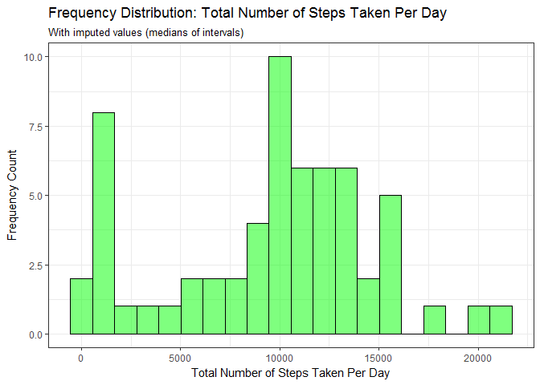
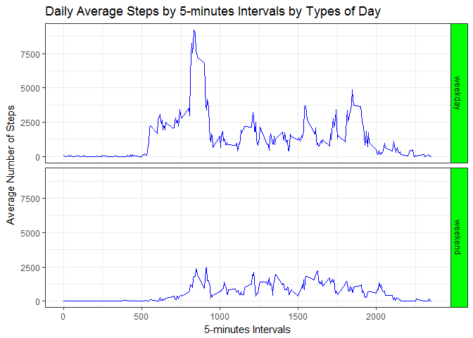

# Reproducible Research: Peer Assessment 1
William Thong  
22nd Dec 2016  
<br>
<br>
We first load the libraries required for this analysis.  While it is subjective, my programming preference is to load libraries I would be using upfront in a single code chunk.

```r
# Load libraries
library(dplyr)
library(ggplot2)
library(lubridate)
```


## Loading and preprocessing the data
This code chunk performs file logistics including checking for working directory, checking for existence of source data file, import the raw data in R and etc.  Summary statistics are generated to provide a view of the 'shape' of the imported data.

```r
# Ensure all files are in the intended working dir else use setwd() to set
getwd()
```

```
## [1] "C:/MyCourse/Data Science_JohnsHopskinsUniversity/05 Reproducible Research/Week02/RepData_PeerAssessment1"
```

```r
#setwd("your working directory") # <--Uncomment and use if required.

# Check, download & unzip raw data file if required
fileUrl <- "https://d396qusza40orc.cloudfront.net/repdata%2Fdata%2Factivity.zip"
if (!file.exists("./activity.zip")){
  download.file(fileUrl,"./activity.zip", mode="wb")
}
if (!file.exists("./activity.csv")){
  unzip("./activity.zip", exdir=".")
}

# Import data, convert date var to proper date format and str() to view
dfActivity <- read.csv("activity.csv", header=TRUE, stringsAsFactors=FALSE)
dfActivity$date <- ymd(dfActivity$date)
str(dfActivity)
```

```
## 'data.frame':	17568 obs. of  3 variables:
##  $ steps   : int  NA NA NA NA NA NA NA NA NA NA ...
##  $ date    : Date, format: "2012-10-01" "2012-10-01" ...
##  $ interval: int  0 5 10 15 20 25 30 35 40 45 ...
```

```r
# Run summary stats on imported data to get a view on the 'shape' of the data
summary(dfActivity)
```

```
##      steps             date               interval     
##  Min.   :  0.00   Min.   :2012-10-01   Min.   :   0.0  
##  1st Qu.:  0.00   1st Qu.:2012-10-16   1st Qu.: 588.8  
##  Median :  0.00   Median :2012-10-31   Median :1177.5  
##  Mean   : 37.38   Mean   :2012-10-31   Mean   :1177.5  
##  3rd Qu.: 12.00   3rd Qu.:2012-11-15   3rd Qu.:1766.2  
##  Max.   :806.00   Max.   :2012-11-30   Max.   :2355.0  
##  NA's   :2304
```
<span style="color:blue">
Output from the `str()` and `summary()` functions indicated that there are NAs in the variable 'steps' and the data distribution of this variable is highly right-skewed.  We could do a boxplot to confirm skewness and outliers visually if required.
</span>

## What is mean total number of steps taken per day?  
1. Calculate the total number of steps taken per day.  
2. Make a histogram of the total number of steps taken each day.  
3. Calculate and report the mean and median of the total number of steps taken per day.

<br>
This code chunk computes the total number of steps taken per day, computes the mean and median and plot.

```r
# Calculate total number of steps taken per day using dplyr package
dfTotalSteps <- dfActivity %>%
        filter(!is.na(steps)) %>%
        group_by(date) %>%
        summarise(varTotalSteps = sum(steps))
str(dfTotalSteps)
```

```
## Classes 'tbl_df', 'tbl' and 'data.frame':	53 obs. of  2 variables:
##  $ date         : Date, format: "2012-10-02" "2012-10-03" ...
##  $ varTotalSteps: int  126 11352 12116 13294 15420 11015 12811 9900 10304 17382 ...
```

```r
# Calculate mean and median of steps
varMeanSteps <- mean(dfTotalSteps$varTotalSteps)
varMedianSteps <- median(dfTotalSteps$varTotalSteps)

# Plot histogram using ggplot2 package. Note: Changing the number of bins will result in different plots
plot.TotalSteps <- ggplot(dfTotalSteps, aes(varTotalSteps)) +
        geom_histogram(bins=20, fill=I("blue"), alpha=1/2, col=I("black")) +
        theme_bw() +
        ggtitle("Frequency Distribution: Total Number of Steps Taken Per Day") +
        labs(x="Total Number of Steps Taken Per Day") +
        labs(y="Frequency Count")
print(plot.TotalSteps)
```

<!-- -->
<br>
<span style="color:blue">
The histogram indicated that the distribution of total number of steps taken per day is right-skewed with the possibilities of extreme outliers.  The mean of the total number of steps taken per day is **10766.19** while the median is **10765**.  Because the distribution is skewed, the median should be used as the average.
</span>     


## What is the average daily activity pattern?  
1. Make a time series plot (i.e. type = "l") of the 5-minute interval (x-axis) and the average number of steps taken, averaged across all days (y-axis).  
2. Which 5-minute interval, on average across all the days in the dataset, contains the maximum number of steps?

<br>
This code chunk computes the daily average steps by 5-minutes intervals, find the observation with the maximum average steps and plot.

```r
# Calculate the mean for the 5 mins intervals
df5MinIntervals <- dfActivity %>%
        filter(!is.na(steps)) %>%
        group_by(interval) %>%
        summarise(varAvgSteps = mean(steps))
str(df5MinIntervals)
```

```
## Classes 'tbl_df', 'tbl' and 'data.frame':	288 obs. of  2 variables:
##  $ interval   : int  0 5 10 15 20 25 30 35 40 45 ...
##  $ varAvgSteps: num  1.717 0.3396 0.1321 0.1509 0.0755 ...
```

```r
# Find the 5-minute interval that conains the maximum number of steps
varMaxAvgSteps <- df5MinIntervals %>%
        filter(varAvgSteps == max(varAvgSteps))
str(varMaxAvgSteps)
```

```
## Classes 'tbl_df', 'tbl' and 'data.frame':	1 obs. of  2 variables:
##  $ interval   : int 835
##  $ varAvgSteps: num 206
```

```r
# Plot time series graph
plot.AvgSteps <- ggplot(df5MinIntervals, aes(x=interval, y=varAvgSteps)) +
        geom_line(colour="blue") +
        theme_bw() +
        ggtitle("Daily Average Steps by 5-minutes Intervals") +
        labs(x="5-minutes Intervals") +
        labs(y="Average Number of Steps") +
        geom_point(data=varMaxAvgSteps,color="red", size=3)
print(plot.AvgSteps)
```

<!-- -->
<br>
<span style="color:blue">
The plot above is the **daily average steps by 5-minutes intervals** across all days.  The time interval **835** minutes have the highest average number of steps at **206.17** steps and as shown in the plot.
</span>


## Imputing missing values
1. Calculate and report the total number of missing values in the dataset (i.e. the total number of rows with NAs).  
2. Devise a strategy for filling in all of the missing values in the dataset. The strategy does not need to be sophisticated. For example, you could use the mean/median for that day, or the mean for that 5-minute interval, etc.  
3. Create a new dataset that is equal to the original dataset but with the missing data filled in.  
4. Make a histogram of the total number of steps taken each day and Calculate and report the mean and median total number of steps taken per day. Do these values differ from the estimates from the first part of the assignment? What is the impact of imputing missing data on the estimates of the total daily number of steps?

<br>
This code chunk computes the number of observations with missing values in variable 'steps'.

```r
# Compute the total number of rows with missing values
varMissing <- sum(is.na(dfActivity$steps))
```
<span style="color:blue">
The total number of observations with missing values in variable 'steps' is **2304**.
</span>
<br>
<br>
The strategy to impute these  **2304** observations with missing values in variable 'steps' is to replace them with the median of total number of steps taken for that time interval into a new dataframe **dfActivityNew**.  Median was chosen over mean because the data distribution is skewed with extreme outliers.

```r
# Replace NAs with medians of time interval and create a new DF
dfActivityNew <- dfActivity %>%
        group_by(interval) %>%
        mutate(steps = replace(steps, is.na(steps), median(steps, na.rm=TRUE))) %>%
        ungroup()

# Check Str() to ensure new DF is the same as the original DF
str(dfActivityNew)
```

```
## Classes 'tbl_df', 'tbl' and 'data.frame':	17568 obs. of  3 variables:
##  $ steps   : int  0 0 0 0 0 0 0 0 0 0 ...
##  $ date    : Date, format: "2012-10-01" "2012-10-01" ...
##  $ interval: int  0 5 10 15 20 25 30 35 40 45 ...
```

```r
# Check if NAs are effectively replace. Expected result is 0.
varMissing <- sum(is.na(dfActivityNew$steps))
varMissing
```

```
## [1] 0
```
<span style="color:blue">
We can confirm that the strategy was effective in replacing NA's with medians of time intervals.
</span>
<br>
<br>
We now proceed to re-create the histogram, find the mean and median with the new dataset and generate the histogram plot.

```r
# Calculate total number of steps taken per day using dplyr package
dfTotalStepsNew <- dfActivityNew %>%
        group_by(date) %>%
        summarise(varTotalSteps = sum(steps))
str(dfTotalSteps)
```

```
## Classes 'tbl_df', 'tbl' and 'data.frame':	53 obs. of  2 variables:
##  $ date         : Date, format: "2012-10-02" "2012-10-03" ...
##  $ varTotalSteps: int  126 11352 12116 13294 15420 11015 12811 9900 10304 17382 ...
```

```r
# Calculate mean and median of steps
varMeanStepsNew <- mean(dfTotalStepsNew$varTotalSteps)
varMedianStepsNew <- median(dfTotalStepsNew$varTotalSteps)

# Plot histogram using ggplot2 package. Note: Changing the number of bins will result in different plots
plot.TotalStepsNew <- ggplot(dfTotalStepsNew, aes(varTotalSteps)) +
        geom_histogram(bins=20, fill=I("green"), alpha=1/2, col=I("black")) +
        theme_bw() +
        ggtitle("Frequency Distribution: Total Number of Steps Taken Per Day", subtitle = "With imputed values (medians of intervals)") +
        labs(x="Total Number of Steps Taken Per Day") +
        labs(y="Frequency Count")
print(plot.TotalStepsNew)
```

<!-- -->
<br>
<span style="color:blue">
The histogram indicated that the distribution of total number of steps taken per day after imputation.  Compared to the histogram earlier (i.e. before imputation), the difference is in the 2nd bin which is now present.  The new mean of the total number of steps taken per day is **9503.87** while the new median is **10395**.  Imputations have lowered the mean and median by **1262.32** and **370** respectively.
</span>

## Are there differences in activity patterns between weekdays and weekends?  
1. Create a new factor variable in the dataset with two levels – “weekday” and “weekend” indicating whether a given date is a weekday or weekend day.  
2. Make a panel plot containing a time series plot (i.e. type = "l") of the 5-minute interval (x-axis) and the average number of steps taken, averaged across all weekday days or weekend days (y-axis). See the README file in the GitHub repository to see an example of what this plot should look like using simulated data.

<br>
This code chunk categorises the dates into weekdays or weekends, and compute the the average steps by intervals and type of day, and generate the panel plot.

```r
# Categorise the dates into weekdays or weekends, and compute the averages.
dfActivityWkDay <- dfActivityNew %>%
        mutate(varDayOfWeek = as.factor(ifelse(weekdays(date) %in% c("Saturday", "Sunday"), "weekend", "weekday"))) %>%
        group_by(interval, varDayOfWeek) %>%
        summarise(varAvgSteps = sum(steps)) %>%
        ungroup()
str(dfActivityWkDay)
```

```
## Classes 'tbl_df', 'tbl' and 'data.frame':	576 obs. of  3 variables:
##  $ interval    : int  0 0 5 5 10 10 15 15 20 20 ...
##  $ varDayOfWeek: Factor w/ 2 levels "weekday","weekend": 1 2 1 2 1 2 1 2 1 2 ...
##  $ varAvgSteps : int  91 0 18 0 7 0 8 0 4 0 ...
```

```r
# Plot panel of line graphs
plot.MyLinePanel <- ggplot(dfActivityWkDay, aes(interval, varAvgSteps)) +
        geom_line(color="blue") +
        facet_grid(varDayOfWeek~.) +
        ggtitle("Daily Average Steps by 5-minutes Intervals by Types of Day") +
        labs(x="5-minutes Intervals") +
        labs(y="Average Number of Steps") +
        theme_bw() +
        theme(strip.background = element_rect(fill="green"))
print(plot.MyLinePanel)
```

<!-- -->
<br>
<span style="color:blue">
The plot indicated that there seems to be higher daily activities on weekdays than on weekends....
</span>

