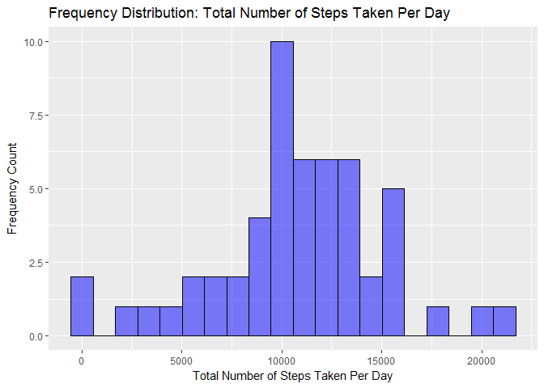
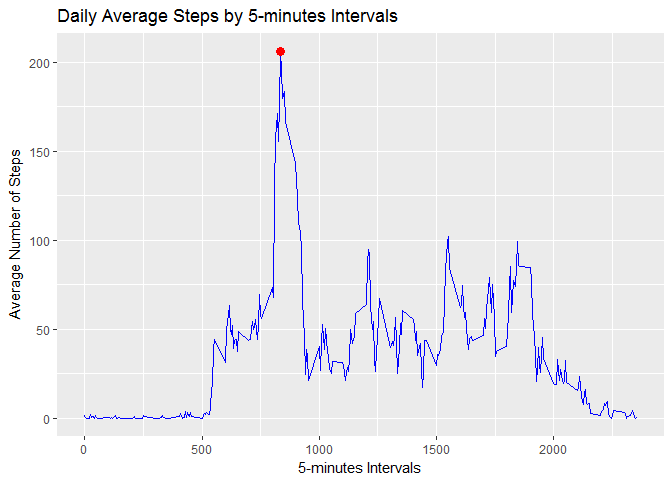

# Reproducible Research: Peer Assessment 1
William Thong  
21st Dec 2016  


```
## 
## Attaching package: 'dplyr'
```

```
## The following objects are masked from 'package:stats':
## 
##     filter, lag
```

```
## The following objects are masked from 'package:base':
## 
##     intersect, setdiff, setequal, union
```

```
## 
## Attaching package: 'lubridate'
```

```
## The following object is masked from 'package:base':
## 
##     date
```


## Loading and preprocessing the data

```r
# Ensure all files are in the intended working dir else use setwd() to set
getwd()
```

```
## [1] "C:/MyCourse/Data Science_JohnsHopskinsUniversity/05 Reproducible Research/Week02/RepData_PeerAssessment1"
```

```r
#setwd("your working directory")

# Check, download & unzip raw data file if required
fileUrl <- "https://d396qusza40orc.cloudfront.net/repdata%2Fdata%2Factivity.zip"
if (!file.exists("./activity.zip")){
  download.file(fileUrl,"./activity.zip", mode="wb")
}
if (!file.exists("./activity.csv")){
  unzip("./activity.zip", exdir=".")
}

# Import data, convert date var to proper date format and str() to view
dfActivity <- read.csv("activity.csv", header=TRUE, stringsAsFactors=FALSE)
dfActivity$date <- ymd(dfActivity$date)
str(dfActivity)
```

```
## 'data.frame':	17568 obs. of  3 variables:
##  $ steps   : int  NA NA NA NA NA NA NA NA NA NA ...
##  $ date    : Date, format: "2012-10-01" "2012-10-01" ...
##  $ interval: int  0 5 10 15 20 25 30 35 40 45 ...
```

```r
# Run summary stats on imported data to get a view on the shape of the data
summary(dfActivity)
```

```
##      steps             date               interval     
##  Min.   :  0.00   Min.   :2012-10-01   Min.   :   0.0  
##  1st Qu.:  0.00   1st Qu.:2012-10-16   1st Qu.: 588.8  
##  Median :  0.00   Median :2012-10-31   Median :1177.5  
##  Mean   : 37.38   Mean   :2012-10-31   Mean   :1177.5  
##  3rd Qu.: 12.00   3rd Qu.:2012-11-15   3rd Qu.:1766.2  
##  Max.   :806.00   Max.   :2012-11-30   Max.   :2355.0  
##  NA's   :2304
```


## What is mean total number of steps taken per day?  
1. Calculate the total number of steps taken per day.  
2. Make a histogram of the total number of steps taken each day.  
3. Calculate and report the mean and median of the total number of steps taken per day.  


```r
# Calculate total number of steps taken per day using dplyr package
dfTotalSteps <- dfActivity %>%
        filter(!is.na(steps)) %>%
        group_by(date) %>%
        summarise(varTotalSteps = sum(steps))
str(dfTotalSteps)
```

```
## Classes 'tbl_df', 'tbl' and 'data.frame':	53 obs. of  2 variables:
##  $ date         : Date, format: "2012-10-02" "2012-10-03" ...
##  $ varTotalSteps: int  126 11352 12116 13294 15420 11015 12811 9900 10304 17382 ...
```

```r
# Calculate mean and median of steps
varMeanSteps <- mean(dfTotalSteps$varTotalSteps)
varMedianSteps <- median(dfTotalSteps$varTotalSteps)

# Plot histogram using ggplot2 package. Note: Changing the number of bins will result in different plots
plot.TotalSteps <- ggplot(dfTotalSteps, aes(varTotalSteps)) +
        geom_histogram(bins=20, fill=I("blue"), alpha=1/2, col=I("black")) +
        ggtitle("Frequency Distribution: Total Number of Steps Taken Per Day") +
        labs(x="Total Number of Steps Taken Per Day") +
        labs(y="Frequency Count")
print(plot.TotalSteps)
```

<!-- -->
<br>
The histogram indicated that the distribution of total number of steps taken per day is right-skewed with the possibilties of extreme outliers.  The mean of the total number of steps taken per day is **10766.1886792453** while the median is **10765**.  Because the distribution is skewed, the median should be used as the average.     

## What is the average daily activity pattern?  
1. Make a time series plot (i.e. type = "l") of the 5-minute interval (x-axis) and the average number of steps taken, averaged across all days (y-axis).  
2. Which 5-minute interval, on average across all the days in the dataset, contains the maximum number of steps?  

```r
# Calculate the mean for the 5 mins intervals
df5MinIntervals <- dfActivity %>%
        filter(!is.na(steps)) %>%
        group_by(interval) %>%
        summarise(varAvgSteps = mean(steps))
str(df5MinIntervals)
```

```
## Classes 'tbl_df', 'tbl' and 'data.frame':	288 obs. of  2 variables:
##  $ interval   : int  0 5 10 15 20 25 30 35 40 45 ...
##  $ varAvgSteps: num  1.717 0.3396 0.1321 0.1509 0.0755 ...
```

```r
# Find the 5-minute interval that conains the maximum number of steps
varMaxAvgSteps <- df5MinIntervals %>%
        filter(varAvgSteps == max(varAvgSteps))
str(varMaxAvgSteps)
```

```
## Classes 'tbl_df', 'tbl' and 'data.frame':	1 obs. of  2 variables:
##  $ interval   : int 835
##  $ varAvgSteps: num 206
```

```r
# Plot time series graph
plot.AvgSteps <- ggplot(df5MinIntervals, aes(x=interval, y=varAvgSteps)) +
        geom_line(colour="blue") +
        ggtitle("Daily Average Steps by 5-minutes Intervals") +
        labs(x="5-minutes Intervals") +
        labs(y="Average Number of Steps") +
        geom_point(data=varMaxAvgSteps, aes(x=interval, y=varAvgSteps, color="red"),
                   size=3)
print(plot.AvgSteps)
```

<!-- -->
<br>
The plot above is the **daily average steps by 5-minutes intervals** across all days.  The time interval **835** minutes have the highest average number of steps at **206.169811320755**.


## Imputing missing values


## Are there differences in activity patterns between weekdays and weekends?
